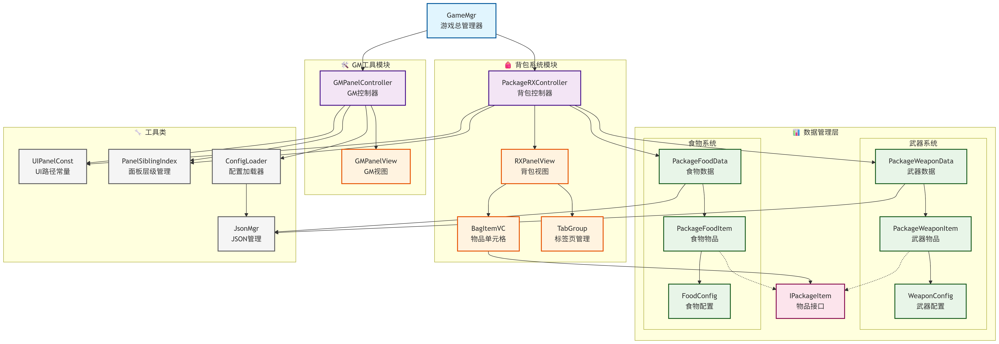
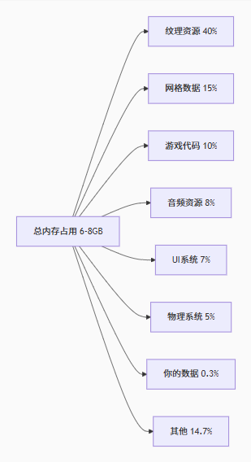

# InfiniteScrollViewBag

背包demo练习，自用  
[itch在线演示（webGL）](https://aoki393.itch.io/packagedemo)  

>参考的教程  
[小棋的游戏背包系统讲解](https://www.bilibili.com/video/BV1cw411B7Z4/)  
[UGUI无限滚动列表](https://www.bilibili.com/video/BV1u2uCzVEwc/)

*仅参考基本框架和原理，代码已经和教程里的很不一样了

## 项目代码结构

```text
📦 Scripts
├── 📂 Data
│   ├── 📂 ConfigData
│   │   ├── 🍎 FoodConfig.cs
│   │   └── ⚔️ WeaponConfig.cs
│   └── 📂 PackageData
│       ├── 📄 IPackageItem.cs
│       ├── 🍔 PackageFoodData.cs
│       └── 🔫 PackageWeaponData.cs
├── 📂 Json                             # Json 管理与解析
│   ├── 🗂️ ConfigLoader.cs
│   ├── 🗂️ JsonMgr.cs
│   ├── 🗂️ WebGLConfigReader.cs
│   └── 📂 LitJson                        # LitJson 库相关文件
├── 📂 Panel
│   ├── 🖥️ LoadingPanel.cs
│   ├── 🖥️ MainPanel.cs
│   ├── 📂 GMPanel
│   │   ├── 🎮 GMPanelController.cs
│   │   └── 👀 GMPanelView.cs
│   └── 📂 InfinitePackage
│       ├── 🎮 PackageRXController.cs
│       ├── 👀 RXPanelView.cs
│       ├── 🎒 BagItemVC.cs
│       └── 📑 TabGroup.cs
├── 🔢 PanelSiblingIndex.cs             # Panel 层级索引相关
├── ⚙️ UIPanelConst.cs                  # UI Panel 常量定义
└── 👨‍💼 GameMgr.cs                       # 游戏主管理器
```

UML图

（绘图绘制：DeepSeek

数据流向

```text
配置文件 → 配置类 → 数据管理器 → 背包物品 → UI显示
(JSON)   (ConfigItem) (PackageData) (PackageItem) (BagItemVC)
```

其中JSON配置文件使用 [Luban](https://www.datable.cn/) 由Excel配置表生成

## 核心架构模式

**MVC模式:**
控制器(PackageRXController, GMPanelController)  
+  
视图(RXPanelView, GMPanelView)  
+  
数据模型(PackageWeaponData, PackageFoodData)

**单例模式+观察者模式:**  
关键管理器类使用单例模式确保全局唯一访问  
 通过UnityEvent实现事件订阅和发布机制

## 主要模块划分

**🎮 核心管理模块 (GameMgr)**  
游戏入口和总控制器  
管理FPS显示、动画状态、音效控制  
提供全局的背包和GM面板开关功能

**🎒 背包系统模块 (PackageRX)**  
PackageRXController: 背包核心逻辑，处理物品显示、排序、选择  
RXPanelView: 背包UI组件引用管理  
BagItemVC: 单个背包物品的视图控制器  
TabGroup: 标签页管理，支持武器/食物分类和排序

**🛠️ GM工具模块 (GMPanel)**  
GMPanelController: GM命令处理，物品生成和清除  
GMPanelView: GM面板UI组件管理  
支持按ID获取物品、批量生成、数据清除等功能

**📊 数据管理模块**  
配置数据: WeaponConfig/FoodConfig 定义物品基础属性  
背包数据: PackageWeaponData/PackageFoodData 管理玩家拥有的物品  
接口设计: IPackageItem 统一物品接口，支持多态处理  

**🗄️Json管理与解析模块**
JsonMgr：单例，负责序列化和反序列化
Json.ConfigLoader：配置文件加载器，支持异步加载和分帧解析。
Json.LitJson：第三方JSON解析库

## 遇到的问题与解决

1. **大量数据加载卡顿**  
   解决方案: 使用虚拟列表技术，仅渲染可见区域的物品，提升性能

2. **物品生成耗时过久**  
   一开始的代码生成11w条数据的耗时达到3h以上，主要是因为每次AddWeapon都触发完整序列化和文件写入，导致了11w次IO操作。  
   解决方案：  
   更改GMPanelController.cs的CreateSomeWeapons方法，PackageWeaponData增加批量导入WeaponList的public方法  

``` C#
// PackageWeaponData.AddWeapon 的调用链
AddWeapon() → WeaponList.Add() → SavePackageWeapon() → Json序列化 → 文件写入
// 每次AddWeapon都触发完整保存！11万次文件IO！
```

优化方案：更改批量生成方法，只进行一次序列化和文件写入

| 指标 |优化前 | 优化后 | 提升倍数 |
| --- | --- | --- | --- |
| 总耗时 | 3小时 | 2-3秒 | 3600倍 |
| 序列化次数 | 11万次 | 1次 | 11万倍 |
| 文件写入次数 | 11万次 | 1次 | 11万倍 |
| 内存分配 | 频繁GC | 一次分配 | 显著改善 |

## 关键技术点

- 泛型编程: `RefreshBagIniteView<T>` 方法支持不同类型的物品列表  
- 异步加载: 使用协程处理配置文件的异步加载  
- 动态滚动: 实现虚拟列表优化，支持大量物品的高效显示  
- 多态处理: 通过IPackageItem接口统一处理武器和食物物品  
- 事件驱动: 使用UnityEvent实现组件间解耦通信  

## 扩展性设计

- 配置化: 所有物品属性通过JSON配置文件管理  
- 模块化: 各功能模块高度独立，便于扩展新物品类型
- 接口化: 通过接口定义契约，支持未来添加新功能

## 总结

这个架构设计体现了良好的软件工程原则，包括单一职责、开闭原则和依赖倒置原则，为后续功能扩展和维护提供了良好的基础。

## 存在的问题

允许创建11w+条武器数据，使持久化的json文件大小达到70MB
对于中等配置电脑：  
✅ 15MB内存占用完全可以接受（只占0.24%）  
一般的RPG游戏在中等配置电脑中运行时会占用多少内存？  
  

❌ 但11万数据的列表操作性能是致命问题  
列表操作和序列化的开销具体会有多大影响  
11万数据量会导致：  
❌ 保存游戏：2秒卡顿（玩家无法接受）  
❌ 加载游戏：1.2秒卡顿（加载体验差）  
❌ 排序操作：100ms卡顿（界面卡顿）  
✅ 单个查找：3ms（勉强可用但需优化）  

可以通过以下方式优化：  
使用字典索引 + 分页加载 + 异步操作  

## 0903  

小问题：  

- 获取食物时并不会把最近获取的食物放到顶部（当该食物已存在于背包中时）
  - 因为代码仅进行了count数量的变化，没有调整json数据的排序
  - fix思路：将该食物原有数量记下，删除该食物，再添加该食物，加上原有数量
- 当已有的Weapon数量过多时（如10w+），再添加会卡顿4~5s
  - 因为List问题，如果要修复，可以将List替换为Dictionary？
  
后续优化：

- 增加删除功能：
  - 选中武器删除、多选武器批量删除
  - 选中食物删除指定数量（可能需要做一个包含数量输入框弹窗）
- 武器数量过多时进度条加载到99%会停一段时间，找出问题所在！
- GM面板生成过多武器（10w+）时会卡5s左右，尝试在MsgArea加入加载进行icon提示或进度条
- 增加音效
  - 切换武器/食物页的音效
  - 点击选中武器/食物的音效
  - GM面板音效
  - 删除音效
- 弃用Resources资源加载方案，换为Addressables资源加载
- 看看UI是否需要打图集，理解Batches数量
